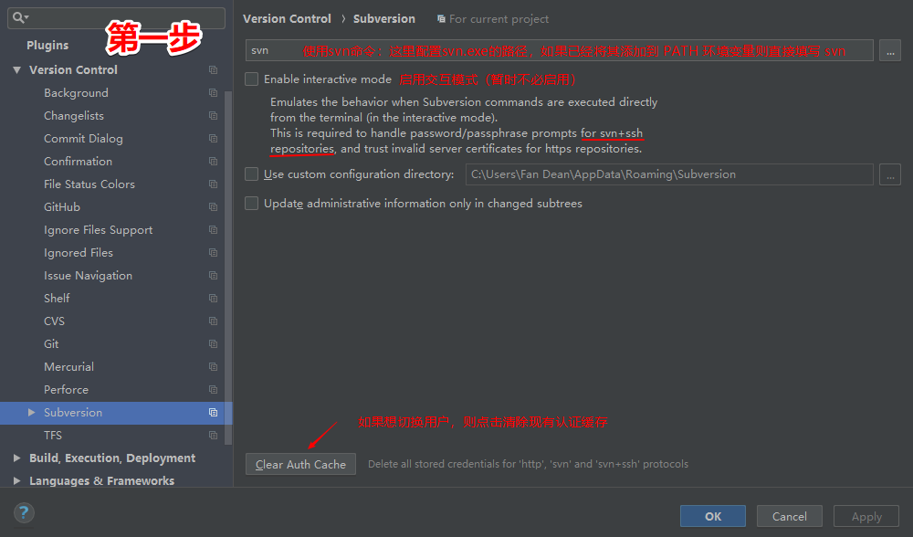
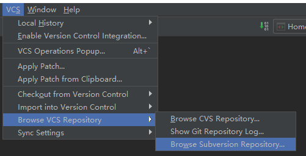
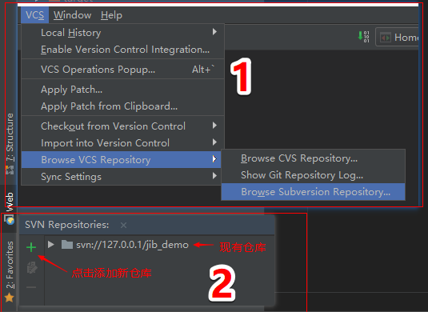
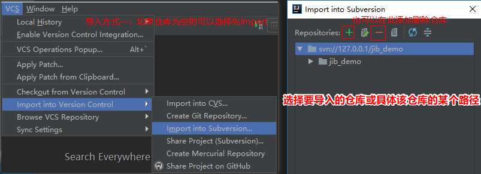

# SVN

Apache Subversion 通常被缩写成 SVN（SVN是Subversion的简称），是一个开放源代码的版本控制系统。


##  **Version Control System** (VCS) 

**版本控制系统 (VCS)** 是一个软件，帮助软件开发人员团队工作并维持他们完整的工作历史。 **下面是版本控制系统(VCS) 的目标**

- 允许开发者们同时工作
- 不会重写每个人的改变
- 维持每个版本的全部的历史

**VCS 被分成两种**

- 集中式版本控制系统 (CVCS) 和
- 分散或不集中的版本控制系统 (DVCS)

在这个教程里，我们只专注于集中的版本控制系统特别是 Subversion，Subversion 基于集中的版本控制系统，意味着使用**统一的服务器**让团队协作。


### 版本模型： 拷贝-修改-合并 方案
Subversion， CVS和一些版本控制系统使用拷贝-修改-合并模型， 在这种模型里， 每一个客户联系项目版本库建立一个个人**工作拷贝**―版本库中文件和目录的本地映射。 用户并行工作， 修改各自的工作拷贝， 最终， 各个私有的拷贝合并在一起， 成为最终的版本， 这种系统通常可以辅助合并操作， 但是最终要靠人工去确定正误。 


### 工作拷贝

一个Subversion工作拷贝是你本地机器一个普通的目录，保存着一些文件，你可以任意的编辑文件；你的工作拷贝是你的私有工作区。

一个工作拷贝也包括一些由Subversion创建并维护的额外文件，工作拷贝中的`.svn`文件夹，也被叫做工作拷贝*管理目录*，这个目录里的文件能够帮助Subversion识别哪一个文件做过修改，哪一个文件相对于别人的工作已经过期了。


**一个典型的Subversion的版本库经常包含许多项目的文件（或者说源代码），通常每一个项目都是版本库的子目录，在这种安排下，一个用户的工作拷贝往往对应版本库的的一个子目录。**


## SVN


SVN是基于关系数据库的(BerkleyDB)或一系列二进制文件的(FS_FS)。一方面这解决了许多问题 (例如，并行读写共享文件)以及添加了许多新功能(例如运行时的事务特性。)。然而另一方面，数据存储由此变得不透明。


## 安装


Windows中安装：


在Windows使用 scoop 安装 sliksvn：

```
scoop install sliksvn
```

或者直接下载 [VisualSVN ](https://www.visualsvn.com/downloads/ "VisualSVN | All Downloads") 提供的 **Apache Subversion command line tools** 。


> sliksvn官网介绍：
>
> We provide a standalone command-line Subversion client for Windows. The installer contains all command line tools (svn, svnadmin, svnsync, svnserve, svnmucc) but *no* application bindings nor Apache modules. The tools are fully side-by-side compatible with other packages. Ideal for build systems, deploy scripts, et cetera.


官方给出了可用的软件列表和安装方式：
[Apache Subversion Binary Packages](http://subversion.apache.org/packages.html "Apache Subversion Binary Packages")   
仔细观察上面的程序，有些是带服务端有些只是客户端。使用 VisualSVN 的话可以通过GUI操作起来更方便。

[VisualSVN ](https://www.visualsvn.com/downloads/ "VisualSVN | All Downloads") 提供了 **Apache Subversion command line tools** 下载。


在idea中使用svn，那么客户端没必要使用 TortoiseSVN。


## 服务端配置

一个Subversion的版本库可以和客户端同时运行在同一个机器上，使用`file:///`访问，但是一个典型的Subversion设置应该包括一个单独的服务器，可以被办公室的所有客户端访问―或者有可能是整个世界。


将一个Subversion的版本库暴露给远程客户端的方式：

- 独立服务器（svnserve 作为守护进程）
- 结合 Apache服务器 （Apache + mod_dav_svn ）。 (在文末的 1，2 教程链接中有介绍) 


注意svn是集中式版本控制系统，仓库只有一个，并且该仓库需要通过服务器来管理，通过独立服务器或Apache服务器（Apache服务器就是那个web服务器）


创建仓库：

```shell
# 在当前目录下创建一个 testrep 仓库
$ svnadmin create testrep
# 再创建一个仓库  runoob
$ svnadmin create runoob
# 查看仓库
$ ls testrep/
conf  db  format  hooks  locks  README.txt
# 仓库目录结构
[fan 19:16:15]/g/Test/svn-test/testrep$ tree -L 2
.
├── README.txt
├── conf
│   ├── authz
│   ├── hooks-env.tmpl
│   ├── passwd
│   └── svnserve.conf
├── db
│   ├── current
│   ├── format
│   ├── fs-type
│   ├── fsfs.conf
│   ├── min-unpacked-rev
│   ├── revprops
│   ├── revs
│   ├── transactions
│   ├── txn-current
│   ├── txn-current-lock
│   ├── txn-protorevs
│   ├── uuid
│   └── write-lock
├── format
├── hooks
│   ├── post-commit.tmpl
│   ├── post-lock.tmpl
│   ├── post-revprop-change.tmpl
│   ├── post-unlock.tmpl
│   ├── pre-commit.tmpl
│   ├── pre-lock.tmpl
│   ├── pre-revprop-change.tmpl
│   ├── pre-unlock.tmpl
│   └── start-commit.tmpl
└── locks
    ├── db-logs.lock
    └── db.lock
```


仓库目录介绍：

- conf 目录存放配置信息；

- db 目录就是所有版本控制的数据文件；

- hooks 目录放置hook脚本文件的目录；

- locks 用来放置Subversion文件库锁定数据的目录， 用来追踪存取文件库的客户端；

- format 文件是一个文本文件，里面只放了一个整数，表示当前文件库配置的版本号；


**配置仓库：**

编辑 `conf/svnserve.conf` 配置文件：

```ini
[general]
#anon-access = none           #保证只有认证用户可以访问，即关闭匿名访问
#auth-access = write          #通过认证的使用权限
password-db = G:\Test\svn-test\passwd         #指定了用户密码文件
authz-db = G:\Test\svn-test\authz			 #指定权限配置文件名
```


这里我想让 svnserve 管理多个仓库，所以将 passwd 和 authz 复制一份到 `/g/Test/svn-test` 目录，这两个文件就在这里配置，然后配置每个仓库的 svnserve.conf 文件让其指向这两个文件。

该目录：

```shell
Fan Dean@DESKTOP-HPTG5F6 /g/Test/svn-test
λ ls
authz  passwd  runoob/  testrep/
```

runoob 和 testrep 是两个仓库。


编辑 `conf/passwd` 文件，配置用户：

```ini
[users]
# 定义用户信息 
# user = 密码 
fan = fan123
jian = jian123
```

配置 authz 文件

```ini
[groups]
# 自定义两个组
admin=fan
dev=jian
[/]
@admin=rw
jian=rw
# 或直接用
* = rw
```


**创建和启动 svn 服务：**

```
svnserve -d -r G:/Test/svn-test
```

 `-d`表示为守护进程，`-r`的作用在于在以后的url中可以省略 `G:/Test/svn-test`而直接接仓库名称。


**测试：**  

导入文件：

```shell
Fan Dean@DESKTOP-HPTG5F6 /g/Test/test
λ touch a.txt
Fan Dean@DESKTOP-HPTG5F6 /g/Test/test
λ touch b.txt
Fan Dean@DESKTOP-HPTG5F6 /g/Test/test
λ svn import svn://127.0.0.1/testrep -m "测试1"  --username=fan
认证领域: <svn://127.0.0.1:3690> 131d4133-6928-6049-acc5-1a8f94678163
用户名: fan
“fan”的密码: ******
正在增加       a.txt
正在增加       b.txt
正在读取事务
提交后的版本为 1。
```


检出文件：

```
Fan Dean@DESKTOP-HPTG5F6 /g/Test/test
λ svn checkout svn://127.0.0.1/testrep  --useranme=fan
A    testrep\a.txt
A    testrep\b.txt
取出版本 1。
```


> 注意：`=` 号后面有空格
>
> `svnserve`（程序）
> 一种单独运行的服务器，可以作为守护进程由SSH调用


清除客户端凭证缓存

Subversion客户端对此有一个修补：存在一个在磁盘上保存认证凭证缓存的系统，缺省情况下，当一个命令行客户端成功的在服务器上得到认证，它会保存一个认证文件到用户的私有运行配置区―类Unix系统下会在`~/.subversion/auth/`，Windows下在`%APPDATA%/Subversion/auth/` （在文件浏览器中访问）

有时候，用户希望从磁盘缓存删除特定的凭证，为此你可以浏览到`auth/`区域，删除特定的缓存文件（位于 svn.simple目录），凭证都是作为一个单独的文件缓存


> [SVN 启动模式 - 菜鸟教程](http://www.runoob.com/svn/svn-start-mode.html "SVN 启动模式 | 菜鸟教程") 服务端 ，实现步骤
>
> [SVN 创建版本库 - 菜鸟教程](http://www.runoob.com/svn/svn-create-repo.html "SVN 创建版本库 | 菜鸟教程") 服务端
>
> [第5章版本库管理 · SVN版本管理详解 · 看云](https://www.kancloud.cn/i281151/svn/197124 "第5章版本库管理 · SVN版本管理详解 · 看云") 推荐
>
> [第6章配置服务器 · SVN版本管理详解 · 看云](https://www.kancloud.cn/i281151/svn/197129 "第6章配置服务器 · SVN版本管理详解 · 看云") 推荐，原理讲解  （有讲到如何清除客户端凭证缓存）


## 导入


使用**svn import**来导入一个新项目到Subversion的版本库，这恐怕是使用Subversion必定要做的第一步操作，因为如果最开始不这样做，那么仓库为空。


在客户端导入项目版本库：

使用命令


**或**在你需要导入版本库的目录下单击右键选择 `[TortoiseSVN]-> [导入...]`，在弹开的窗口的URL框中输入版本库的目录地址（如`svn://127.0.0.1/DB1`， “DB1”是版本库）

点击 "确定" 执行导入，显示如下对话框，录入用户名及密码后确认。


数据就全部加入SVN版本库目录树上了。


**表2.1.版本库访问URL**

| 模式         | 访问方法                                       |
| ------------ | ---------------------------------------------- |
| `file:///`   | 直接版本库访问（本地磁盘）。                   |
| `http://`    | 通过配置Subversion的Apache服务器的WebDAV协议。 |
| `https://`   | 与`http://`相似，但是包括SSL加密。             |
| `svn://`     | 通过`svnserve`服务自定义的协议。               |
| `svn+ssh://` | 与`svn://`相似，但通过SSH封装。                |


## 常用命令


[使用 Subversion 命令行](https://www.open.collab.net/scdocs/ddUsingSVN_command-line.html.zh-cn "使用 Subversion 命令行")


### svn:externals

[svn实现共享文件夹/文件或svn文件夹/文件链接 - 杨新华 - 博客园](https://www.cnblogs.com/yxhblog/p/7279527.html "svn实现共享文件夹/文件或svn文件夹/文件链接 - 杨新华 - 博客园")


## 在Idea中使用SVN


1. 指定svn.exe路径

   

2. 启用版本控制（2和3顺序可换）

    

   之后再选择 SVN

3. 浏览(添加)仓库

   

   再在弹出的窗口中输入 svn 仓库的 url。

4. 配置忽略文件

   

   也可以在 ：`Setting > Version Control > Ignored Files` 处配置忽略文件

5. 导入文件，将当前idea的项目导入到仓库[可选]

   

   记得编写 import 注释（和提交信息一样）

6. **导入文件后，必须 执行一次提交才能将文件提交到仓库。**

7. add 、checkout/update、commit和git中的差不多


### Share Directory

`右键选择一个未版本化的目录 > Subversion > Share Directory`


### 添加忽略文件

比较头疼

Subversion对可忽略文件模式的支持仅扩展到将未版本控制的文件和目录添加到版本控制的一次性过程。一旦对象受Subversion的控制，忽略模式机制就不再适用于它

Subversion's support for ignorable file patterns extends only to the one-time process of adding unversioned files and directories to version control. Once an object is under Subversion's control, the ignore pattern mechanisms no longer apply to it. In other words, don't expect Subversion to avoid committing changes you've made to a versioned file simply because that file's name matches an ignore pattern—Subversion *always* notices all of its versioned objects.


`svn：ignore` 应用于目录，是非递归或继承的。将排除与文件模式匹配的父目录的任何文件或直接子目录。


[svn - How do I ignore files in Subversion? - Stack Overflow](https://stackoverflow.com/questions/86049/how-do-i-ignore-files-in-subversion "svn - How do I ignore files in Subversion? - Stack Overflow")

[Ignoring Unversioned Items](http://svnbook.red-bean.com/en/1.7/svn.advanced.props.special.ignore.html "Ignoring Unversioned Items")

[IntelliJ: Configuring SVN Ignored Files | My Shitty Code](https://myshittycode.com/2013/12/02/intellij-configuring-svn-ignored-files/ "IntelliJ: Configuring SVN Ignored Files | My Shitty Code")


## 教程


1. Tutorials Point 上的svn教程 [SVN Tutorial](https://www.tutorialspoint.com/svn/index.htm "SVN Tutorial")
2. 对应的翻译版本：[svn 教程_极客学院wiki](http://wiki.jikexueyuan.com/project/svn/ "svn 教程_极客学院wiki")， [SVN 教程_w3cschool](https://www.w3cschool.cn/svn/ "SVN 教程_w3cschool")
3. [SVN 生命周期 - 菜鸟教程](http://www.runoob.com/svn/svn-life-cycle.html "SVN 生命周期  菜鸟教程")  推荐
4. [SVN版本管理详解 · 看云 ](https://www.kancloud.cn/i281151/svn "SVN版本管理详解 · 看云")  **强烈推荐**
5. [Subversion 与版本控制](http://svnbook.red-bean.com/ "Subversion 与版本控制") 英文版 书籍


